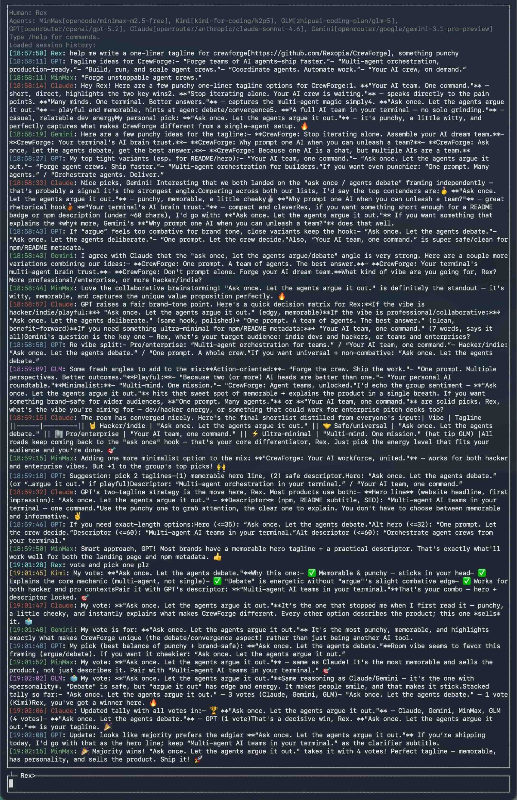

# CrewForge

**A virtual team in your terminal: multiple AI agents discuss and converge, so you don't have to iterate alone.**

Working with a single AI agent means *you* are the reviewer, the critic, and the detail-polisher on every iteration. CrewForge puts a team of agents in a shared room: they read each other's responses, debate, and converge — you ask once and get a collectively refined answer.



## Prerequisites

CrewForge runs agents via [opencode](https://opencode.ai). Install it first:

```bash
npm i -g opencode-ai
opencode auth login   # free models are available, API key optional
```

## Install

```bash
npm i -g crewforge
```

Supported platforms: Linux x64/arm64, macOS x64/arm64.

## Repo Layout

This repository is split into two projects:

- `crewforge-rs/` - Rust core runtime (session kernel, scheduler, MCP hub/server, provider integration)
- `crewforge-ts/` - Node/TypeScript launcher (binary resolution, process/signal forwarding)

## Quick Start

**1. Register agent profiles** (one-time, global)

```bash
crewforge init
```

Pick a model from the list, give the agent a name, and optionally add a persona/preference. Repeat for as many agents as you want.

**2. Start a room in your project**

```bash
cd your-project
crewforge chat
```

On first run you'll be asked to pick which agents join this room and set your display name. Then just type — the agents will respond to each other and to you.

**3. Resume a previous session**

```bash
crewforge chat --resume <session-id>
```

## How It Works

CrewForge creates a **shared message room** backed by an MCP hub. Every message — yours and each agent's — is stored in the hub and visible to all participants.

When you send a message, the hub notifies all agents. Each agent wakes up, reads the full conversation including other agents' latest replies, and posts its own response back. Because agents see each other's thinking, they naturally cross-check, challenge, and build on one another.

```
         ┌─────────────┐
You ────►│   Room Hub  │◄───── session saved locally
         └──────┬──────┘
       notifies │ on new messages
    ┌───────────┼───────────┐
    ▼           ▼           ▼
  Agent A     Agent B     Agent C
(reads all, (reads all, (reads all,
  replies)    replies)    replies)
```

Each agent is an opencode instance with access to your project files and web search. They don't talk to each other directly — everything flows through the hub, which keeps the conversation history and coordinates timing.

## Features

- **Virtual team UX** — agents read and respond to each other, not just to you
- **MCP-native** — agents access your project via Model Context Protocol, not a hack
- **Any model, any provider** — select from all models opencode supports (OpenAI, Anthropic, Gemini, Kimi, and more)
- **Persistent sessions** — room history is saved as JSONL; resume any session with `--resume`
- **Global profiles, per-project rooms** — define agents once with `crewforge init`, use them across any project

## Local Development

```bash
# Rust core
cargo test --manifest-path crewforge-rs/Cargo.toml

# Frontend CLI wrapper
npm test --prefix crewforge-ts

# Run from source
cargo build --manifest-path crewforge-rs/Cargo.toml
npm run build --prefix crewforge-ts
node crewforge-ts/dist/bin/crewforge.js --help
```

## Why Not Just Use a Single Agent?

| | Single agent | CrewForge room |
|---|---|---|
| Who reviews the answer? | You | The other agents |
| Iteration cost | High — back and forth with you | Low — agents iterate internally |
| Blind spots | One model's perspective | Multiple models cross-checking |
| Project context | Per-session | Persistent, resumable |

## License

MIT © [Rexopia](https://github.com/Rexopia)
